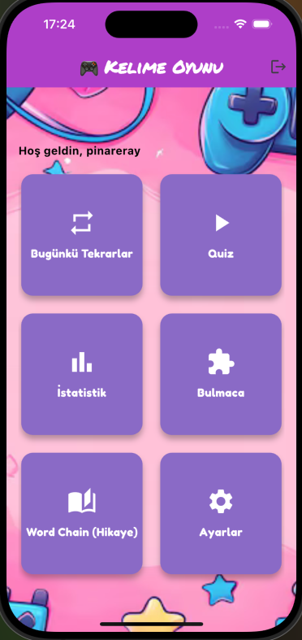
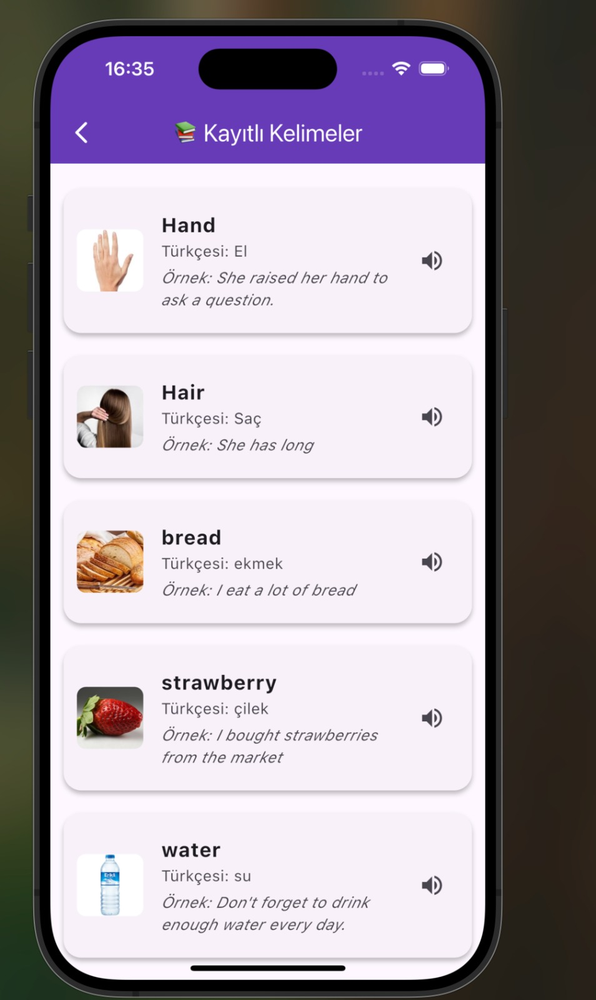
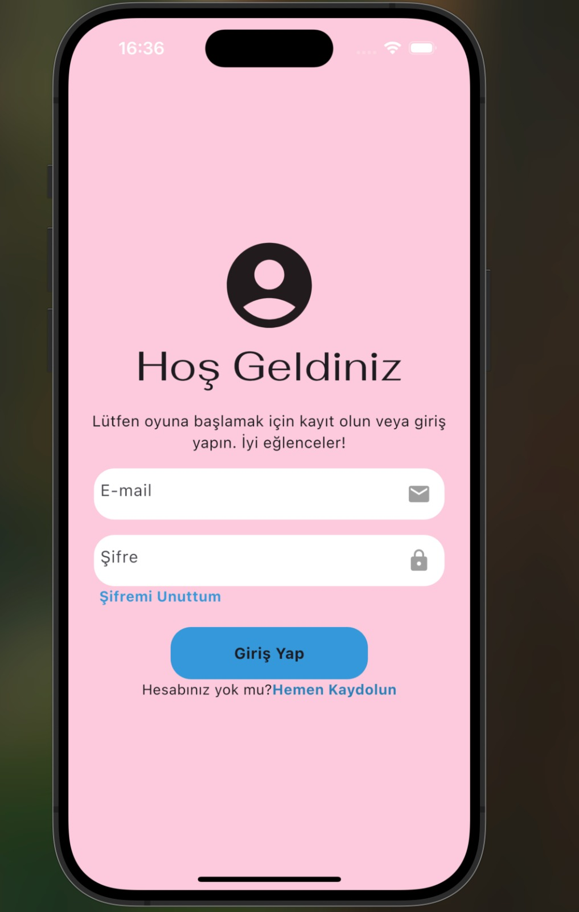
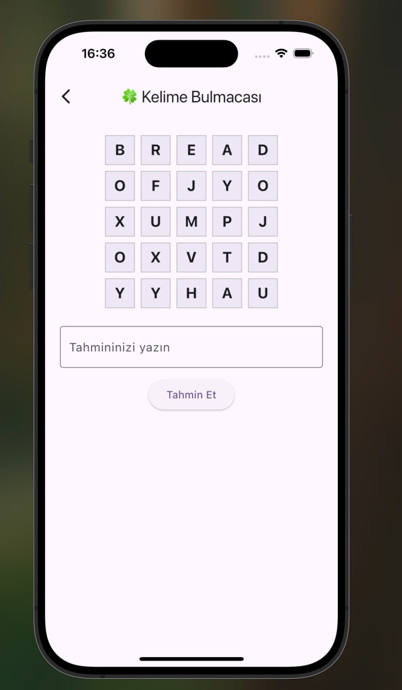
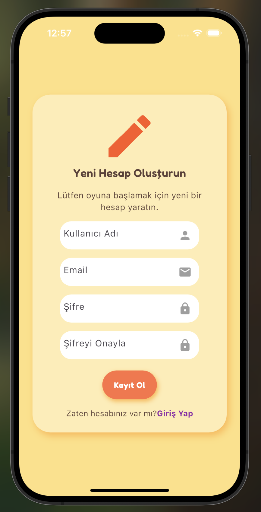
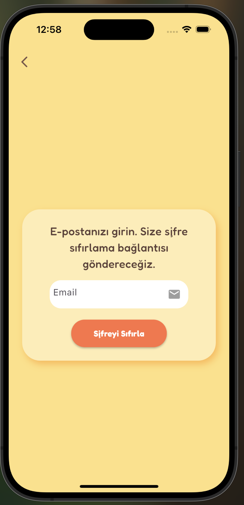

# 🎓 Flutter Word Game - Kelime Ezberleme Uygulaması

Bu proje, 6 tekrarlı öğrenme algoritmasıyla çalışan bir İngilizce kelime ezberleme mobil uygulamasıdır. Kullanıcılar kelime ekleyebilir, tekrar yapabilir, quiz çözebilir, başarı oranlarını görebilir ve bulmaca oynayarak öğrenebilir. 

## 🚀 Özellikler

Not: Kayıt, giriş, kelime ekleme, oyun gibi çalışma sırasında yapılan yanlış işlemlerde hata sebepleri kullanıcıya gösterilir.

- ✅ Kullanıcı Kayıt / Giriş / Şifremi Unuttum (Firebase Auth)
- ✅ Kelime Ekleme (görsel, örnek cümle)
- ✅ Quiz Modülü (6 kez doğru cevaba dayalı öğrenme)
- ✅ Ayarlanabilir günlük tekrar limiti (Ayarlar)
- ✅ İstatistik ekranı (% başarı, grafik, PDF çıktısı)
- ✅ Bulmaca (öğrenilen kelimelerle)
- ✅ Word Chain (öğrenilmiş kelimelerle hikaye + LLM destekli görsel)

## 🧠 Kullanılan Teknolojiler

- Flutter + Dart
- Firebase Auth
- Cloud Firestore
- Firebase Storage

### 🖼️ Ekran Görüntüleri

|  |  |  |  |  |  |

## 🧪 Kurulum

git clone https://github.com/pinareray/flutter_word_game.git
cd flutter_word_game
flutter pub get
flutter run

## Android cihazlar için apk link:
https://drive.google.com/file/d/1q-93jykA6UkDtk73Ta2D6RHiyajTnlIt/view?usp=drive_link

